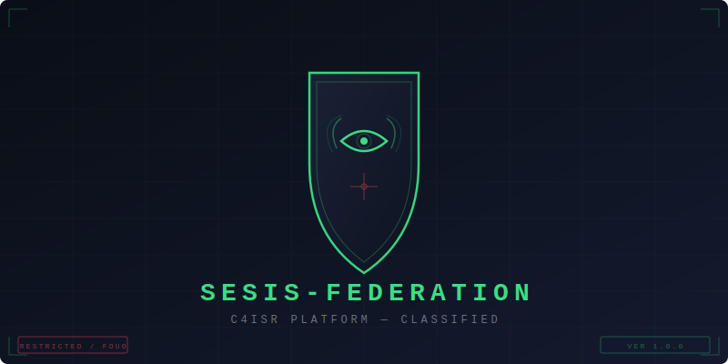

<div align="center">



</div>

<p align="center">
  
  
  
  
  
  
  
</p>

---

## 📝 Tabla de Contenidos

- [Visión General](#-visión-general)
- [Arquitectura](#-arquitectura)
- [Módulos](#-módulos)
- [Stack Tecnológico](#-stack-tecnológico)
- [Instalación](#-instalación)
- [Uso](#-uso)
- [API Reference](#-api-reference)
- [Casos de Uso](#-casos-de-uso)
- [Mobile](#-mobile)
- [Despliegue](#-despliegue)
- [Seguridad](#-seguridad)
- [Licencia](#-licencia)

---

## 💡 Visión General

**SESIS-FEDERATION** es la convergencia de 5 sistemas militares de inteligencia en una sola plataforma C4ISR (Command, Control, Communications, Computers, Intelligence, Surveillance and Reconnaissance) soberana.

### ¿Qué problema resuelve?

Los sistemas de inteligencia y comando militar suelen operar en silos: el análisis satelital no conversa con la inteligencia de fuentes abiertas, los agentes en campo no reciben alertas en tiempo real del C2, y el planeamiento de operaciones se hace con herramientas desconectadas del ciclo de inteligencia.

SESIS-FEDERATION resuelve esto mediante:

| Problema | Solución |
|----------|----------|
| Datos aislados por módulo | Pipeline de fusión cross-módulo con NATS event bus |
| Múltiples LLMs sin coordinación | Orquestador único (fsociety) con 7 personas tácticas |
| Sin correlación multi-fuente | Motor de correlación ML con reglas combinables |
| Sin evaluación de daño automatizada | BDA multi-fuente (satélite + drone + campo) |
| Planeamiento manual de operaciones | Generación automática de OPORD + Wargaming |
| Sin app móvil táctica | COP offline-first con mesh networking P2P |
| Cumplimiento normativo manual | Compliance reporter automático (ENS/NIST/STANAG) |

---

## 🏗️ Arquitectura

```
┌─────────────────────────────────────────────────────────┐
│                    SESIS-FEDERATION C4ISR                                │
│         Plataforma Unificada de Gobierno Digital Militar                   │
└─────────────────────────────────────────────────────────┘
                          |
         ┌──────┬──────┬──────┬──────┐
         │SESIS││AEGIS││Atalaya││Global│
         │(C2) ││(SAT)││(OSINT)││(Intel)│
         └──────┘└──────┘└──────┘└──────┘
                          |         |         |         |
                          └───────┴───────&#x2518
                                        |
                    ┌─────────────────────┐
                    │      Fusion Engine (Core)        │
                    │  + Event Bus (NATS)              │
                    │  + fsociety LLM Orchestrator     │
                    │  + ABAC + Audit Chain            │
                    │  + Correlation Engine (ML)       │
                    │  + Pipeline Cross-Modulo          │
                    └─────────────────────┘
                          |         |         |
         ┌──────┬──────┬──────┐
         │SpyMgr ││Mobile  ││Tactical│
         │(Agents)││(Flutter)││(Ops)   │
         └──────┘└──────┘└──────┘
```

### Flujo de Datos Cross-Módulo

```
Satélite detecta blindados en X
  → OSINT cruza con eventos GDELT + RSS + NewsAPI
    → Intel analiza y genera evaluación de amenaza
      → C2 crea alerta táctica en el dashboard
        → Agents notifica a operadores en campo
          → ML correlaciona con datos históricos
            → Audit chain registra todo
```

---

## 📦 Módulos

### 1. sesis-core (Núcleo Unificado)
| Componente | Descripción |
|-----------|-------------|
| `config.py` | Settings Pydantic v2 con validación multi-entorno |
| `security.py` | JWT (access 15min / refresh 7d) + ABAC multi-nivel + bcrypt |
| `audit.py` | Cadena de hash SHA-256 inmutable con verificación |
| `classification.py` | STANAG 4774/4778 + TLP + niveles PUBLIC a TOP SECRET |
| `events.py` | NATS JetStream event bus con fallback in-memory |
| `pipeline.py` | Pipeline de fusión cross-módulo con routing + retry |
| `llm_orchestrator.py` | Orquestador fsociety central con 7 personas tácticas |
| `crypto_quantum.py` | Kyber768 + Dilithium3 + AES-256-GCM híbrido |

### 2. sesis-c2 (Mando y Control — desde SESIS)
| API | Endpoints | Función |
|-----|-----------|---------|
| `v1/` | alerts, assets, brain, ingestion, intel, media, policy, sensors, timeline | Dashboard C2 táctico |
| `v2/` | border, c2, cyber, ew, logistics, space | Operaciones multidominio |

### 3. sesis-satellite (Inteligencia Satelital — desde AEGIS-IMINT)
| Servicio | Función |
|----------|---------|
| `sentinel.py` | Descarga de imágenes Sentinel-2 con selección de nubosidad |
| `detector.py` | Detección YOLOv8 con filtrado de clases OTAN |
| `change_detection.py` | Diferencia morfológica entre imágenes temporales |
| `ollama_analyst.py` | Análisis IMINT con fsociety |
| `gdelt.py` | Correlación con eventos GDELT |
| `report_generator.py` | Reportes PDF clasificados con huella SHA-256 |

### 4. sesis-osint (Inteligencia Multi-Fuente — desde Atalaya)
| Disciplina | Descripción |
|------------|-------------|
| OSINT | Fuentes abiertas (GDELT, NewsAPI, RSS) |
| SOCMINT | Redes sociales y fuentes públicas |
| CYBINT | Inteligencia cibernética |
| FININT | Inteligencia financiera |
| DARKWEB | Monitoreo de dark web |
| GEOINT | Inteligencia geoespacial |
| IMINT | Inteligencia de imágenes |
| HUMINT | Fuentes humanas |
| **Tools**: `archive_tools`, `cert_tools`, `dns_tools`, `web_tools`, `whois_tools`, `social_tools`, `document_tools` | |

### 5. sesis-intel (Análisis de Inteligencia — desde Global-Intelligence)
| Componente | Función |
|-----------|---------|
| `orchestrator.py` | Orquestador de agentes de inteligencia |
| `osint.py` | Recolector multi-fuente |
| `scenario.py` | Análisis de escenarios |
| `synthesis.py` | Síntesis de briefings |
| `rag.py` | Búsqueda semántica con pgvector |
| `signing.py` | Firma digital Ed25519 de reportes |
| LLM Providers: Ollama, OpenRouter, vLLM | Enrutamiento de LLM por clasificación |

### 6. sesis-agents (Gestión de Agentes — desde SpyManager)
| Servicio | Función |
|----------|---------|
| `agent_sync.py` | Sincronización de agentes en campo |
| `encryption.py` | Cifrado extremo-a-extremo |
| `neo4j_service.py` | Análisis de vínculos y grafos |
| `siem_service.py` | Reenvío de eventos a SIEM |
| `kill_switch.py` | Borrado remoto selectivo |
| `link16_service.py` | Integración STANAG 5516 / Link 16 |
| `watermark.py` | Marcado digital anti-fugas |
| `sensor_mesh.py` | Red IoT de sensores militares |
| `data_diode.py` | Transferencia unidireccional entre dominios |

### 7. sesis-tactical (Operaciones Tácticas — Nuevo)
| Servicio | Función |
|----------|---------|
| `opord_generator.py` | Generación de OPORD según doctrina OTAN |
| `wargaming.py` | Simulación de COAs con Monte Carlo |
| `joint_fires.py` | Coordinación de fuegos conjunto |
| `bda.py` | Evaluación de daños multi-fuente |
| `psyops.py` | Operaciones psicológicas con fsociety |

### 8. sesis-ml (Machine Learning)
| Componente | Función |
|-----------|---------|
| `isolation_forest.py` | Detección de anomalías en telemetría |
| `vision.py` | Inferencia YOLOv8 en memoria |
| `correlation_engine.py` | Motor de correlación multi-fuente con reglas |
| `rules/` | Reglas de correlación (threat, deployment, etc.) |

### 9. sesis-mobile (COP Móvil)
| Componente | Función |
|-----------|---------|
| `main.dart` | App Flutter con tema táctico oscuro |
| `mesh_service.dart` | Mesh networking P2P offline-first |
| `mesh_protocol.dart` | Protocolo de mensajería cifrada y firmada |
| `api_client.dart` | Cliente HTTP con certificate pinning |
| `theme/` | Paleta militar oscura |

---

## 📱 Stack Tecnológico

| Capa | Tecnología | Versión |
|------|-----------|---------|
| **Backend** | FastAPI + Celery + Redis + NATS | Python 3.11+ |
| **Base de Datos** | PostgreSQL + pgvector + Neo4j | PG16 / Neo4j 5 |
| **LLM** | fsociety (Qwen2.5-Coder) + Ollama | Q8_0 GGUF |
| **Frontend Web** | Next.js 14 + Tailwind + shadcn/ui | Node 20 |
| **Mobile** | Flutter 3 + Dart 3 | SDK >=3.0 |
| **Vector DB** | pgvector | PG16 |
| **Cifrado** | AES-256-GCM + Fernet + Kyber768/Dilithium3 | hybrid |
| **C2 Messaging** | NATS JetStream | v2 |
| **Monitoreo** | Prometheus + Grafana | latest |
| **Contenedores** | Docker Compose + K8s | compose v3.9 |

---

## 🔧 Instalación

### Requisitos Mínimos

| Recurso | Mínimo | Recomendado |
|---------|--------|-------------|
| CPU | 4 cores | 8+ cores |
| RAM | 8 GB | 16+ GB |
| Disco | 20 GB | 50+ GB SSD |
| Docker | 24+ | 24+ |
| Ollama | 0.1+ | 0.3+ |

### 1. Clonar el Repositorio

```bash
git clone https://github.com/murdok1982/SESIS-FEDERATION.git
cd SESIS-FEDERATION
```

### 2. Configurar Entorno

```bash
cp .env.example .env
# Editar .env con tus valores (SECRET_KEY, passwords, etc.)
```

Variables obligatorias:

| Variable | Descripción | Ejemplo |
|----------|-------------|---------|
| `SECRET_KEY` | Clave JWT (mín. 32 chars) | `openssl rand -hex 32` |
| `POSTGRES_PASSWORD` | Password de base de datos | |
| `NEO4J_PASSWORD` | Password de Neo4j | |
| `GRAFANA_ADMIN_PASSWORD` | Password de Grafana | |

### 3. Iniciar el Sistema

```bash
# Desarrollo (hot-reload)
docker compose up -d --build

# Producción
docker compose -f docker-compose.yml up -d
```

### 4. Verificar Estado

```bash
# Health check
curl http://localhost:8000/
# Respuesta esperada:
# {"service":"SESIS-FEDERATION","version":"1.0.0","status":"operational"}
```

### 5. Instalar el Modelo fsociety (Ollama)

```bash
# Si ya tienes fsociety instalado:
docker compose exec ollama ollama list

# Si no:
ollama pull fsociety
# o crearlo desde GGUF:
ollama create fsociety -f Modelfile
```

### 6. Acceder a la Interfaz

| Servicio | URL | Descripción |
|----------|-----|-------------|
| API Backend | `http://localhost:8000` | FastAPI + Swagger en `/docs` |
| Frontend COP | `http://localhost:3000` | Common Operating Picture |
| Grafana | `http://localhost:3001` | Monitoreo (admin:pass) |
| Neo4j | `http://localhost:7474` | Link Analysis (bolt:7687) |

---

## 🏃 Uso

### CLI / API

#### Autenticación

```bash
# Obtener token JWT
curl -X POST http://localhost:8000/api/v1/auth/login \
  -H "Content-Type: application/json" \
  -d '{"username":"admin","password":"your_password"}'

# Usar token en requests
export TOKEN="eyJhbGciOi..."
curl -H "Authorization: Bearer $TOKEN" http://localhost:8000/api/v1/health
```

#### Operaciones Tácticas

```bash
# Generar OPORD
curl -X POST http://localhost:8000/api/v1/tactical/opord/generate \
  -H "Authorization: Bearer $TOKEN" \
  -H "Content-Type: application/json" \
  -d '{
    "mission": "Asegurar el cruce del rio en coordenadas 42.5N 2.3E",
    "enemy_situation": "2 companias mecanizadas a 15km al NE",
    "own_situation": "Batallon de infanteria reforzado",
    "concept": "Ataque de pinzas con apoyo de fuegos"
  }'

# Simular Curso de Accion
curl -X POST http://localhost:8000/api/v1/tactical/wargaming/montecarlo \
  -H "Authorization: Bearer $TOKEN" \
  -H "Content-Type: application/json" \
  -d '{"name": "COA-Alpha", "forces": ["infantry", "armor", "artillery"]}'

# Evaluar Danos de Batalla
curl -X POST http://localhost:8000/api/v1/tactical/bda/assess \
  -H "Authorization: Bearer $TOKEN" \
  -H "Content-Type: application/json" \
  -d '{"strike_id": "STRIKE-001", "target": {"lat": 42.5, "lon": 2.3}, "weapon": "JDAM"}'

# Deconfliccion de Fuegos
curl -X POST http://localhost:8000/api/v1/tactical/fires/deconflict \
  -H "Authorization: Bearer $TOKEN" \
  -H "Content-Type: application/json" \
  -d '{"fire_mission": {"mission_id": "FIRE-001", "weapon_type": "artillery", "target": {"lat": 42.5, "lon": 2.3}}, "active_fires": []}'

# Generar Mensaje PSYOPS
curl -X POST http://localhost:8000/api/v1/tactical/psyops/message \
  -H "Authorization: Bearer $TOKEN" \
  -H "Content-Type: application/json" \
  -d '{"target_audience": "enemy_troops", "objective": "Depongan las armas y rindanse"}'
```

#### Inteligencia

```bash
# Analizar imagen satelital
curl -X POST http://localhost:8000/api/v1/satellite/analyze \
  -H "Authorization: Bearer $TOKEN" \
  -H "Content-Type: application/json" \
  -d '{"lat": 42.5, "lon": 2.3, "date": "2026-05-23"}'

# Consultar inteligencia multi-fuente
curl -X GET "http://localhost:8000/api/v1/osint/intel?q=posiciones+enemigas&limit=10" \
  -H "Authorization: Bearer $TOKEN"

# Obtener reportes de inteligencia
curl -X GET http://localhost:8000/api/v1/intel/reports \
  -H "Authorization: Bearer $TOKEN"
```

#### Agentes y Sensores

```bash
# Registrar sensor IoT
curl -X POST http://localhost:8000/api/v1/agents/sensors/register \
  -H "Authorization: Bearer $TOKEN" \
  -H "Content-Type: application/json" \
  -d '{"sensor_id": "SENSOR-001", "sensor_type": "acoustic", "location": {"lat": 42.5, "lon": 2.3}}'

# Enviar lectura de sensor
curl -X POST http://localhost:8000/api/v1/agents/sensors/ingest \
  -H "Authorization: Bearer $TOKEN" \
  -H "Content-Type: application/json" \
  -d '{"sensor_id": "SENSOR-001", "reading": {"signal_strength": 0.85, "frequency_hz": 350}}'

# Reporte de agente en campo
curl -X POST http://localhost:8000/api/v1/agents/intel/reports \
  -H "Authorization: Bearer $TOKEN" \
  -H "Content-Type: application/json" \
  -d '{"title": "Avistamiento en sector 7", "body": "Columna blindada en movimiento...", "classification": "secret"}'
```

### Frontend COP

La interfaz web unificada muestra en una sola pantalla:

```
+-----------------------------------------------------+
| CLASSIFICATION: RESTRICTED — SESIS-FEDERATION COP   |
+-----------------------------------------------------+
| [C2] [SAT] [OSINT] [INTEL] [AGENTS] [TACT] [SENSORS]|
+----------+-----------------------+------------------+
| MAPA     | INTEL FEED           | LINK ANALYSIS    |
| TACTICO  | - OSINT: actividad   | [Neo4j Graph]    |
| [+ capas]| - SAT: blindados     |                   |
|          | - HUMINT: contacto   | SENSOR MESH      |
| ALERTS   |                       | - Acoustic: OK   |
| [CRIT]   | THREAT ASSESSMENT    | - Seismic: OK    |
| [HIGH]   | Objetivo: Confianza  | - RF: degraded   |
| [MED]    | [========== 85%]     |                   |
+----------+-----------------------+------------------+
| [OPORD] [COA SIM] [BDA] [TASK]   | fsociety LLM > _ |
+----------------------------------+------------------+
```

### Mobile COP

La app Flutter permite operar en campo con funcionalidad offline:

```bash
cd mobile/sesis_cop
flutter run
```

Características:
- Mapa táctico con unidades en tiempo real
- Feed de inteligencia offline-first
- Mesh networking P2P entre unidades
- Ghost mode para entornos hostiles
- Duress PIN con alerta silenciosa
- Dead man's switch

---

## 📋 API Reference

### Endpoints Disponibles

| Prefijo | Módulo | Descripción | Documentación |
|---------|--------|-------------|---------------|
| `/api/v1/health` | Core | Health check | `/docs` |
| `/api/v1/auth` | Core | Autenticación JWT + MFA | `/docs` |
| `/api/v1/c2` | C2 | Mando y control táctico | `/docs` |
| `/api/v2/*` | C2 | Operaciones multidominio | `/docs` |
| `/api/v1/satellite` | AEGIS | Inteligencia satelital | `/docs` |
| `/api/v1/osint` | Atalaya | OSINT multi-fuente | `/docs` |
| `/api/v1/intel` | Global | Análisis de inteligencia | `/docs` |
| `/api/v1/agents` | SpyMgr | Gestión de agentes | `/docs` |
| `/api/v1/tactical/opord` | Tactical | Generación de OPORD | `/docs` |
| `/api/v1/tactical/wargaming` | Tactical | Simulación COA | `/docs` |
| `/api/v1/tactical/fires` | Tactical | Coordinación de fuegos | `/docs` |
| `/api/v1/tactical/bda` | Tactical | Evaluación de daños | `/docs` |
| `/api/v1/tactical/psyops` | Tactical | Operaciones psicológicas | `/docs` |
| `/api/v1/agents/sensors` | Sensors | IoT sensor mesh | `/docs` |

Documentación interactiva: `http://localhost:8000/docs` (Swagger UI)

---

## 🎯 Casos de Uso

### CASO 1: Operación Ofensiva Multi-Dominio

**Escenario:** Se detecta una concentración de fuerzas enemigas en una zona de operaciones.

**Flujo:**
1. **Satélite** detecta nuevos blindados vía Sentinel-2 + YOLOv8
2. **OSINT** cruza coordenadas con GDELT y encuentra reportes de movimiento de tropas
3. **Pipeline** dispara evento `satellite.detection` → suscriptores en osint + c2
4. **Intel** analiza y genera evaluación de amenaza con severidad 4/5
5. **ML** correlaciona con regla `high_confidence_threat` → alerta CRÍTICA
6. **C2** muestra alerta en el dashboard táctico
7. **Tactical** genera OPORD parabatallón de respuesta
8. **Wargaming** simula 3 COAs con Monte Carlo (1000 iteraciones)
9. **Joint Fires** deconflicta el plan de fuegos
10. **Agents** notifica a operadores en campo vía mobile COP
11. **BDA** evalúa daños post-strike (satélite + drone + campo)
12. **Audit chain** registra toda la operación

**Resultado:** Ciclo completo < 15 minutos. Sin intervención manual.

### CASO 2: Vigilancia de Frontera

**Escenario:** Monitoreo continuo de zona fronteriza con sensores IoT y satélite.

**Flujo:**
1. **Sensor Mesh** detecta vibraciones sísmicas inusuales en sector 7
2. **Satélite** programa captura de imagen del sector (menor nubosidad)
3. **Change Detection** encuentra nuevas posiciones vs imagen anterior
4. **OSINT** busca actividad en fuentes abiertas de la región
5. **Correlación** combina sensor + satélite + osint → alerta de infiltración
6. **C2** despliega unidad de reacción rápida
7. **Mobile COP** recibe misión en tiempo real con mapa y coordenadas

**Resultado:** Detección temprana con 3 fuentes de verificación.

### CASO 3: Operación PSYOPS y Decepción

**Escenario:** Campaña de guerra psicológica para desmoralizar fuerzas enemigas.

**Flujo:**
1. **PSYOPS Engine** genera mensajes personalizados para 3 audiencias
2. **fsociety LLM** adapta el mensaje al contexto cultural y lingüístico
3. **Plan** define campaña en 3 fases (preparación, emisión, evaluación)
4. **Deception plan** genera medidas de camuflaje y señuelos
5. **Agents** despliega mensajes vía radios, altavoces y canales encubiertos
6. **OSINT** monitorea efectividad en redes sociales y fuentes abiertas
7. **Effectiveness** se evalúa y ajusta la campaña

**Resultado:** Campaña de influencia completa con medición de efectividad.

### CASO 4: Coordinación de Fuegos Conjunta

**Escenario:** Apoyo de fuegos con artillería, CAS y drones.

**Flujo:**
1. **Joint Fires** recibe targets del C2 con prioridades
2. **Deconflicto** verifica que no haya fuerzas propias cerca
3. **Colateral** evalúa riesgo de daño colateral (bajo/medio/alto)
4. **Plan de fuegos** coordina artillería (40km) + CAS (50km) + drones (20km)
5. **BDA** evalúa daños post-impacto con satélite + drone
6. **Consolidated BDA** genera reporte multi-fuente

**Resultado:** Coordinación segura con deconflicto automático.

---

## 📱 Mobile

La app móvil Flutter (`mobile/sesis_cop/`) proporciona:

### Características

| Feature | Descripción |
|---------|-------------|
| **COP Móvil** | Mapa táctico, feed de inteligencia, alertas |
| **Offline-first** | SQLite local + sync cuando hay conectividad |
| **Mesh P2P** | Comunicación directa entre unidades sin infraestructura |
| **Ghost Mode** | Interfaz falsa para entornos hostiles |
| **Duress PIN** | PIN de coacción con alerta silenciosa |
| **Dead Man's Switch** | Alarma si operador no confirma periódicamente |
| **Certificate Pinning** | Seguridad de comunicación |
| **Cifrado E2E** | AES-256-GCM en todos los mensajes |

### Build

```bash
cd mobile/sesis_cop

# Android
flutter build apk --release

# iOS
flutter build ios --release

# Wear OS
cd ../imc_wearable
flutter build apk --release
```

---

## 🚀 Despliegue

### Docker Compose (Recomendado)

```bash
# Iniciar todos los servicios
docker compose up -d

# Ver logs
docker compose logs -f

# Detener
docker compose down
```

### Kubernetes (Producción)

```bash
kubectl apply -f infra/k8s/
```

### Servicios

| Servicio | Puerto | Descripción |
|----------|--------|-------------|
| API | 8000 | Backend FastAPI |
| Frontend | 3000 | Next.js COP |
| PostgreSQL | 5432 | Base de datos + pgvector |
| Redis | 6379 | Caché + Celery broker |
| NATS | 4222 | Event bus C2 |
| Neo4j | 7474/7687 | Link analysis |
| Ollama | 11434 | LLM fsociety |
| Prometheus | 9090 | Métricas |
| Grafana | 3001 | Dashboards |

---

## 🛡️ Seguridad

### Principios

- **Zero Trust**: Todo acceso requiere autenticación, sin excepciones
- **Defensa en Profundidad**: Múltiples capas de seguridad
- **Soberanía de Datos**: Todo el procesamiento dentro del perímetro de confianza
- **Air-Gap**: Operación sin conexión a Internet

### Controles Implementados

| Control | Implementación |
|---------|---------------|
| Autenticación | JWT (access 15min + refresh 7d) + MFA TOTP |
| Autorización | ABAC multi-nivel (PUBLIC a TOP SECRET) |
| Cifrado en tránsito | mTLS + HTTPS |
| Cifrado en reposo | AES-256-GCM + Fernet |
| Quantum-safe | Kyber768 + Dilithium3 |
| Auditoría | Hash chain SHA-256 inmutable |
| Rate Limiting | Por IP y por usuario |
| CORS | Orígenes específicos (nunca `*`) |
| Data Diode | Transferencia unidireccional entre dominios |
| Anti-spoofing | Validación de emisor/audiencia JWT |

### Cumplimiento

| Estándar | Estado | Documentación |
|----------|--------|---------------|
| STANAG 4774/4778 | ✅ | `compliance/STANAG_4774_4778.md` |
| ENS ALTA | ✅ | `compliance/ENS_ALTA_matrix.md` |
| NIST 800-171 | ✅ | Generado por `ComplianceReporter` |

---

## 📜 Estructura del Repositorio

```
SESIS-FEDERATION/
├── backend/                    # Backend FastAPI + Celery
│   ├── app/
│   │   ├── core/            # Nucleo unificado (config, security, audit, pipeline, llm)
│   │   ├── api/              # Routers REST (v1, v2, satellite, osint, intel, agents, tactical)
│   │   ├── services/         # Logica de negocio (por modulo)
│   │   ├── agents/           # Agentes de inteligencia
│   │   ├── db/               # Modelos + sesion + migraciones
│   │   └── schemas/          # Pydantic schemas
│   └── migrations/                  # SQL migrations
├── frontend/                   # Next.js 14 COP Dashboard
├── mobile/                     # Flutter COP App + Wear OS
├── ml/                          # Machine Learning (anomalias, correlacion, vision)
├── scripts/                     # Utilidades (seed, keys, ollama)
├── infra/                       # Nginx, Prometheus, Grafana, K8s
├── compliance/                  # Matrices de cumplimiento (STANAG, ENS, NIST)
├── docs/                        # Documentacion arquitectura y API
├── docker-compose.yml
└── .env.example
```

---

## 📄 Licencia

MIT License — ver [LICENSE](LICENSE).

---

<div align="center">
  <sub>SESIS-FEDERATION v1.0 — 274 archivos · 9 módulos · 5 repos fusionados</sub>
  <br>
  <sub>Construido con ❤️ sobre fsociety, FastAPI, Next.js y Flutter</sub>
</div>
